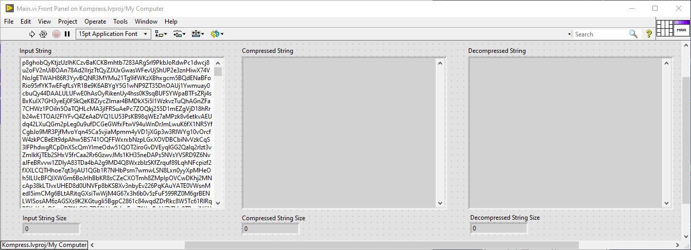
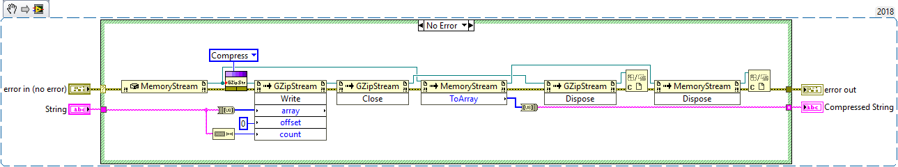
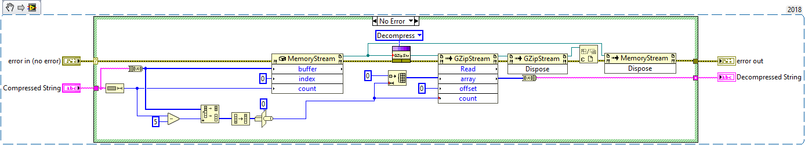

# Kompress - LabVIEW String Compression-Decompression VIs
A project with LabVIEW VIs for compressing and decompression strings using dotNET and gzip.

**The Project includes the following tools/VIs:**

- [x] Compress String.vi
- [x] Custom GZipStream.vi
- [x] Decompress String.vi
- [x] Main.vi

# Minimum Requirements
* LabVIEW 2018 (32/64 bit)
* .NET Core 3.1

# Code Snippets

 **Main.vi:**

Example VI that 5MB string of random characters and number to compress and decompress.

- - - -

**Compress String.vi:** 

- - - -

**Decompress String.vi:** 

